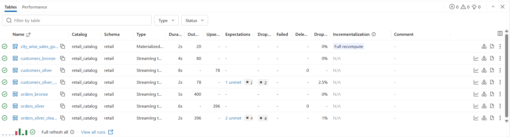
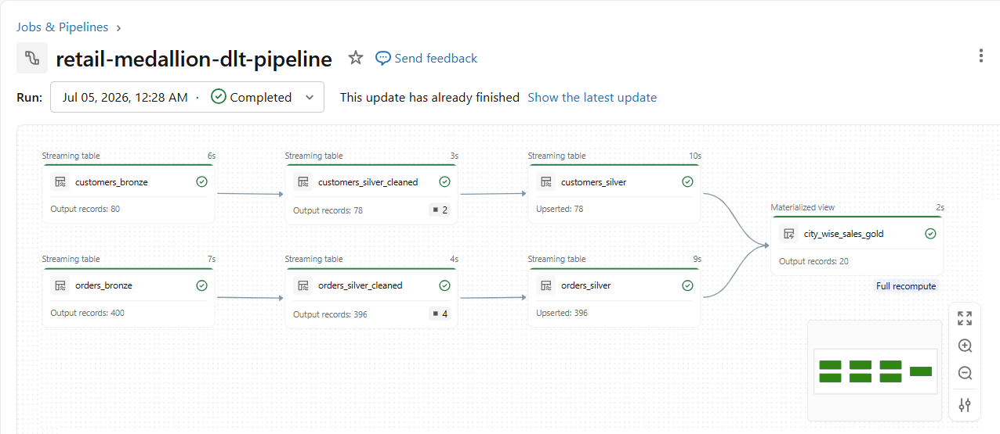
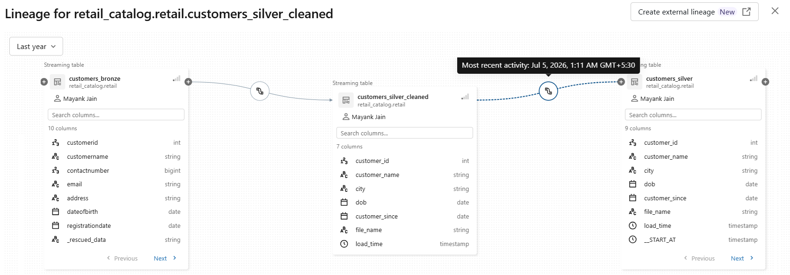
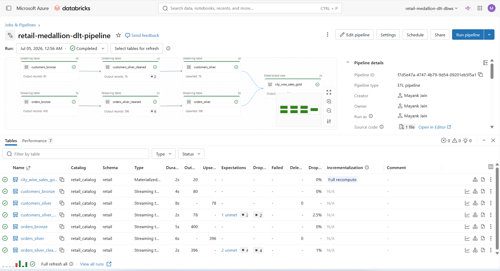

# Databricks DLT Medallion Pipeline (Unity Catalog)

End-to-end governed ETL pipeline on Azure Databricks — **no DBFS mounts, no storage keys, zero secrets in code**. Built with Delta Live Tables (Lakeflow Declarative Pipelines), Auto Loader, and Unity Catalog Volumes.

## Architecture

```
CSV files → UC Volume (landing zone)
    |
    v  Auto Loader (cloud_files) — incremental ingestion
BRONZE   orders_bronze, customers_bronze        + file lineage metadata
    |
    v  Type casting, standardization, DLT Expectations
SILVER   orders_silver_cleaned, customers_silver_cleaned
    |
    v  APPLY CHANGES INTO — declarative CDC
SILVER 
ENRICHED  customers_silver (SCD Type 2), orders_silver (SCD Type 1)
    |
    v  Join + aggregate, filter to current SCD2 version
GOLD     customer_orders_gold (materialized view)
```

## Secure storage access (no keys)

Storage is accessed through a fully governed chain — no account keys or SAS tokens anywhere:

```
Azure Access Connector (managed identity)
        → Storage Credential
        → External Location
        → Unity Catalog Volume  (/Volumes/retail_catalog/retail/landing_vol/)
```

Full setup steps: [`setup/unity_catalog_setup.md`](setup/unity_catalog_setup.md)

## Pipeline layers

| File | Layer | What it does |
|---|---|---|
| [`01_bronze.sql`](transformations/01_bronze.sql) | Bronze | Auto Loader (`cloud_files`) streaming ingestion of orders & customers CSVs. Adds `_metadata.file_name` + load timestamp for lineage. |
| [`02_silver_cleaned.sql`](transformations/02_silver_cleaned.sql) | Silver (cleaned) | Type casting (INT/DATE/DOUBLE), text standardization (`INITCAP`, `TRIM`, `LOWER`), and data-quality enforcement with DLT Expectations — invalid rows dropped automatically. |
| [`03_silver_customers_scd2.sql`](transformations/03_silver_customers_scd2.sql) | Silver (dim) | Customers as **SCD Type 2** via `APPLY CHANGES INTO` — full change history with `__START_AT` / `__END_AT`. No manual MERGE. |
| [`04_silver_orders_scd1.sql`](transformations/04_silver_orders_scd1.sql) | Silver (fact) | Orders as **SCD Type 1** — latest state only. |
| [`05_gold.sql`](transformations/05_gold.sql) | Gold | Materialized view of per-customer metrics (total orders, total spend), joined on the **current** customer version (`__END_AT IS NULL`). |

## Data quality

Expectations enforced at the Silver layer:

```sql
CONSTRAINT valid_order_id EXPECT (order_id IS NOT NULL)    ON VIOLATION DROP ROW
CONSTRAINT valid_customer EXPECT (customer_id IS NOT NULL) ON VIOLATION DROP ROW
```



## Incremental processing — proven, not just claimed

After the initial load (24 orders), a new file with **4 rows** was dropped into the landing volume and the pipeline was triggered (normal update, no full refresh):



- `orders_bronze` processed **only the 4 new rows** — Auto Loader's checkpoint skipped the already-ingested file
- The customers tables processed **nothing** (no new customer files)
- The gold materialized view refreshed **incrementally** (Databricks Enzyme) instead of a full recompute — visible as the "Incremental" tag on the run




## What "declarative" actually means here

No orchestration code was written. The tables were declared; DLT read the dependencies, built the execution graph automatically, enforced quality rules, and processed data incrementally — bronze feeding silver feeding gold.

## Key learnings

- DLT code never runs in a notebook (`No module named 'dlt'`) — it runs **through a pipeline**. Notebook = recipe, pipeline = kitchen.
- Inside expectations, reference the **output** column names, not the source ones. (Cost one failed run to learn.)
- When a tutorial hits a deprecated feature, don't force it — understand why it changed and learn the modern replacement.

## How to run

1. Complete the Unity Catalog storage setup → [`setup/unity_catalog_setup.md`](setup/unity_catalog_setup.md)
2. Upload sample CSVs to `/Volumes/<catalog>/<schema>/landing_vol/orders/` and `/customers/`
3. Create a new **Lakeflow Declarative Pipeline (DLT)**, point it at the `transformations/` folder, set your target catalog & schema
4. Run the pipeline — watch the lineage graph build itself
5. Drop another CSV (see [`sample_data/customers_new.csv`](sample_data/customers_new.csv)) into the landing folder and run a normal update to see incremental processing in action
6. Drop another CSV (see [`sample_data/orders_new.csv`](sample_data/orders_new.csv)) into the landing folder and run a normal update to see merge processing in action

## The error that started this project

Most Databricks tutorials still teach `dbutils.fs.mount()`. On a modern Unity Catalog workspace, that path is closed:

```
FeatureDisabledException: DBFS mounts are not available on this workspace
```

DBFS mounts are deprecated — they share one credential across the entire workspace and bypass governance. Instead of forcing the old approach, this project implements the modern, governed replacement end to end.

## Tech stack

Azure Databricks · Unity Catalog · Delta Live Tables / Lakeflow · Auto Loader · ADLS Gen2 · SCD Type 1 & 2 · Medallion Architecture · SQL



---

---

## Related Documents

- `README.md` – Project overview and architecture
- `docs/medallion_architecture.md` – Bronze, Silver, and Gold layers
- `docs/delta_live_tables.md` – Delta Live Tables (DLT)
- `docs/change_data_feed.md` – Delta Change Data Feed (CDF)
- `docs/pipeline_design.md` – End-to-end pipeline implementation
- `setup/unity_catalog_setup.md` – Secure storage configuration

---


## Author & Document Details

| Field | Details |
|-------|---------|
| **Project** | Databricks DLT Medallion Pipeline Project |
| **Author** | Mayank Jain |
| **Repository** | GitHub Portfolio Project |
| **Last Updated** | July 2026 |

*Built as a hands-on learning project. Open to Data Engineering opportunities — feel free to connect on [LinkedIn](https://www.linkedin.com/in/mayank-jain-b2b220104).*

